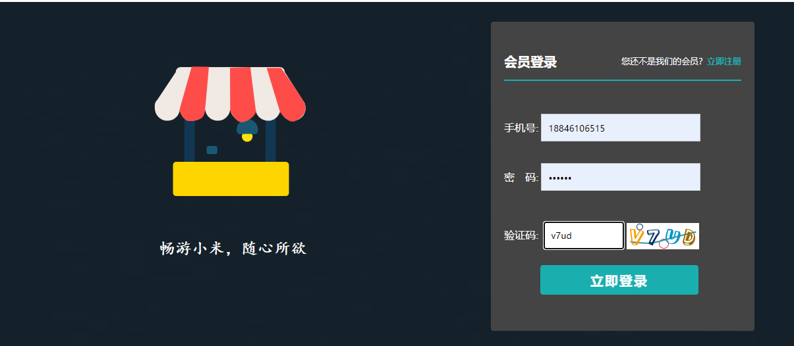
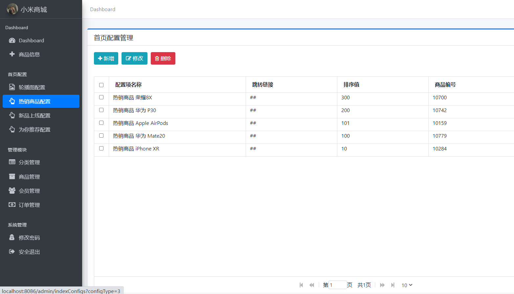

# JAVA+SpringBoot网上商城014

## 一、系统介绍

前台商城系统：包含首页登录、商品分类、新品上线、首页轮播、商品推荐、商品搜索、商品展示、购物车、订单结算、订单流程、个人订单管理、会员中心、帮助中心等模块。 

后台管理系统：包含数据面板、轮播图管理、商品管理、订单管理、会员管理、分类管理、设置等模块。

## 二、所用技术

- 后台：Springboot + Mybatis + Swagger2 + Maven +mysql
  前台：Thymeleaf + Bootstrap + AdminLTE

## 三、环境介绍

基础环境 :IDEA/eclipse, JDK 1.8, Mysql5.7,Maven

源码+数据库脚本

所有项目以及源代码本人均调试运行无问题 可支持远程调试运行

## 四、页面截图

以下为商城项目的部分页面，不一一列举，重要节点及重要功能的页面都已整理在下方，如想看项目全部可以自行下载运行。

#### 前台商城页面

#### 后台管理页面

## 五、浏览地址

前台地址：http://localhost:8086/

用户名：18846106515  密码：123456

后台地址：http://localhost:8086/admin/login

用户名：admin  密码：123456

## 运行项目

文件夹 doc/temp.txt 中有详细说明。

## 六、安装教程

1、下载项目到本地并解压；

2、将项目使用IDE以maven的形式导入；

3、将数据库导入Navicat中（sql在文件夹sql/db_mall_starsea.sql）；

4、修改配置文件（application.properties）中数据库名、用户名、密码；

5、将图片文件解压到任意盘符下（图片在文件夹doc/upload.zip）；

6、修改com.siro.mall.common.Constants文件的 FILE_UPLOAD_DIC 字段，改为你解压图片的路径；

7、运行StarseaMallApplication类的main方法；

8、浏览器上访问 localhost:8080 即可。
